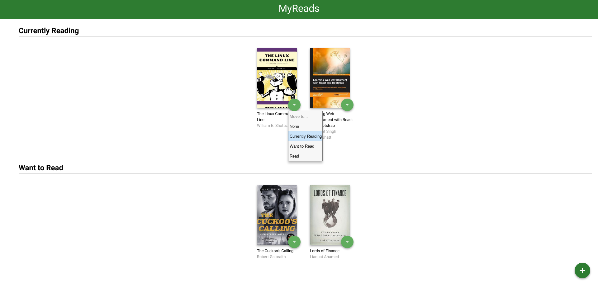
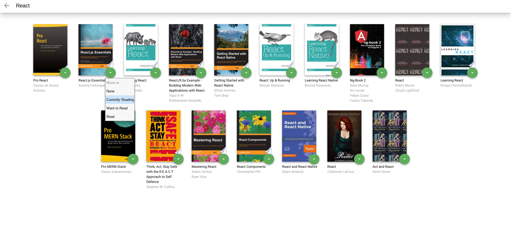

# MyReads: A Book Lending App

An app, written in react.js, that allows you to search for books, save your favorites to colleactions including: currently reading, want to read, and read. Once saved, books can be moved between collections and removed if desired.

## Prerequisites
#### MacOS
1. Install [Homebrew](https://brew.sh/) by running `/usr/bin/ruby -e "$(curl -fsSL https://raw.githubusercontent.com/Homebrew/install/master/install)"` in the terminal.
1. Check that it was installed by running `brew --version`. You should see the version number that was installed.
1. Run `brew install node`.
1. Run `node --version`.
1. Check that `npm` was installed as well by running `npm --version`.
1. Run `brew install yarn`.
1. Run `npm --version`.
1. Run `yarn install && yarn --version`

#### Windows
1. Please download the [Node.js Installer](https://nodejs.org/en/download/), go through the installation process, and restart your computer once you're done.
1. Please follow the `yarn` [installation instructions](https://classic.yarnpkg.com/en/docs/install#debian-stable).
1. Run `yarn --version` to make sure `yarn` has been successfully installed.

#### Linux
1. Please follow [these instructions](https://ostechnix.com/install-node-js-linux/) to install Node.js.
1. Run `sudo apt-get install -y build-essential`.
1. Please follow the `yarn` [installation instructions](https://classic.yarnpkg.com/en/docs/install#debian-stable).
1. Run `yarn --version` to make sure `yarn` has been successfully installed.

## How to Install
1. Clone this repo.
1. Run `npm install` in the main folder of the repo.

## How to Use
1. Run `npm start` in the main folder of the repo.
1. Click the plus button in the bottom right corner to search for an add a book.
1. Click the down arrow button next to a book to change collections.

    

1. Search by title or author in the input field using the list of [search tearms provided here](./SEARCH_TERMS.md).
1. Click the down arrow button next to a book to add to a collection.
1. Click the back arrow in the top left corner to go back to the home page.

    
